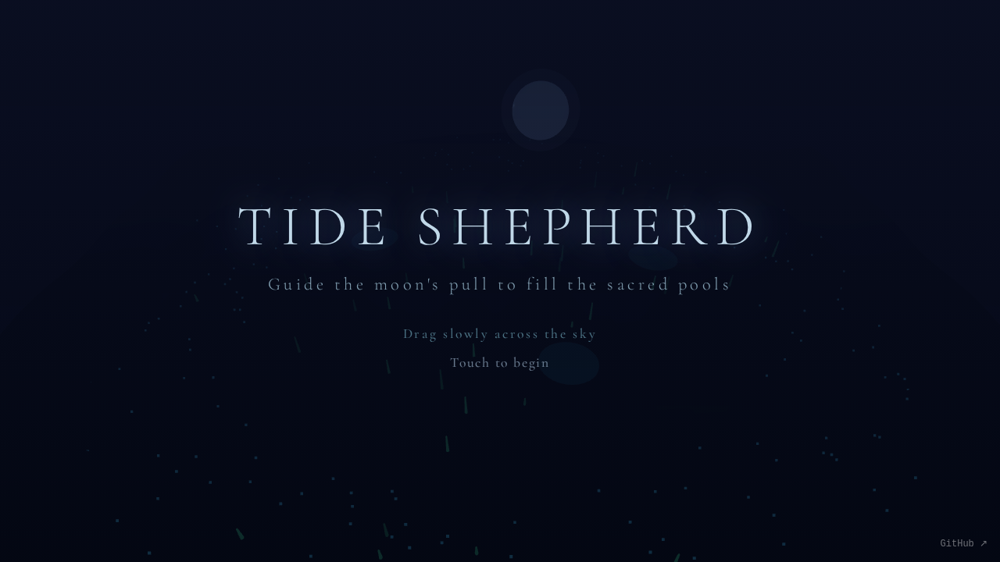

# Tide Shepherd

Guide the moon's pull to awaken the sleeping sea.

Drag the moon across the night sky to attract tidal water through ancient coastal channels. Fill the three sacred pools to awaken the sleeping sea creatures. Too fast and the water floods past; too slow and the tide retreats before the pools fill.

## How to Play

- **Drag** the moon across the sky to attract water flow
- The water flows toward your position — find the **balanced speed** to guide water into the channels
- Fill all **three sacred pools** (Ⅰ, Ⅱ, Ⅲ) to awaken the sea creatures and win
- Move too fast = water overshoots the pools
- Move too slow = tide retreats before filling pools

## Built With

- [Three.js r183](https://threejs.org/)
- [Tone.js v15.1.22](https://tonejs.github.io/)

## Links

- **Play:** https://nishivector.github.io/tide-shepherd/
- **Repo:** https://github.com/nishivector/tide-shepherd
